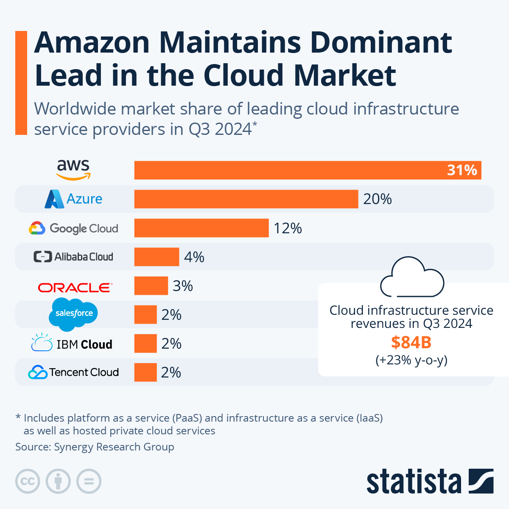

## Cloud Computing Fundamentaks

- Cloud computing is a way of accessing computing resources usally over the internet.
- The services provided can vary from Compute, Storage and Database, Analytics and AI/ML, IoT, Networking etc.

### How do we know if something is in the Cloud?

- If the data, applications or services are accessible from an internet-enabled device without being tied to specific hardware, likely they are in the cloud.

### Difference between on-prem and the cloud?

| Feature                 | On-Premises                  | Cloud                              |
|-------------------------|------------------------------|------------------------------------|
| **Infrastructure**      | Local data centres and servers. | Hosted in remote data centres.    |
| **Cost**                | High upfront hardware costs (CapEx). | Pay-as-you-go (OpEx).             |
| **Maintenance**         | Managed in-house.            | Managed by the cloud provider.    |
| **Scalability**         | Limited by physical hardware. | Near-infinite scalability.        |
| **Access**              | Local access within organisation. | Accessible from anywhere online.  |

### Cloud Deployment Models

- **Private Cloud**:
  - Definition: Cloud infrastructure is dedicated to a single organisation.
  - Use Case: Industries with strict security and compliance (e.g. finance, healthcare, piblic sector).
  - Advantages: High control, customisation, and security.
  - Disadvantages: High costs and limited scalability compared to public cloud.

- **Public Cloud**:
  - Definition: Cloud resources are shared among multiple users/organisations.
  - Use Case: Startups, SMEs, or anyone looking for cost-effective solutions.
  - Advantages: Low cost, easy to scale, minimal maintenance.
  - Disadvantages: Lower control and potential security concerns.

- **Hybrid Cloud**:
  - Definition: Combines private and public clouds, allowing data and applications to move between them.
  - Use Case: Organisations needing to balance security (private) with scalability (public).
  - Advantages: Flexibility and optimised costs.
  - Disadvantages: Complexity in integration and management.

- **Multi-Cloud**:
  - Definition: Using multiple cloud providers to optimise performance and avoid vendor lock-in.
  - Use Case: Large enterprises or organisations with diverse requirements.
  - Advantages: Resilience, vendor flexibility.
  - Disadvantages: Increased complexity and potential cost inefficiencies.

### Types of Cloud Services: IaaS, PaaS, SaaS

| Service   | Description                                     | Examples               | Advantages                      | Disadvantages                  |
|-----------|-------------------------------------------------|-----------------------|----------------------------------|--------------------------------|
| **IaaS**  | Infrastructure as a Service: Virtualised computing resources. | AWS EC2, Azure VM     | High flexibility and control.   | Requires technical expertise. |
| **PaaS**  | Platform as a Service: Provides a framework for app development. | Heroku, AWS Elastic Beanstalk | Simplifies development.         | Less control over the underlying infrastructure. |
| **SaaS**  | Software as a Service: Hosted software applications. | Gmail, Microsoft 365  | Easy to use, no installation.   | Limited customisation.         |

The **shared responsibility model** for the cloud means that depending on the cloud service model (IAAS, PAAS, SAAS), the responsibility the cloud provider has vs the client varies.

### Advantages/Disadvantags of the Cloud for businesses

**Advantages**:

- **Cost Efficiency**: Pay-as-you-go model reduces upfront investments.
- **Scalabilit**y: Rapidly adjust resources to match demand.
- **Flexibility**: Remote access enables a distributed workforce.
- **Security**: Providers invest heavily in securing their platforms.
- **Innovation**: Access to advanced technologies like AI and ML.

**Disadvantages**:

- **Dependence on Internet**: Downtime affects access.
- **Vendor Lock-In**: Migrating from one provider to another can be challenging.
- **Security Concerns**: Data breaches or misconfigurations can pose risks.
- **Compliance Challenges**: Ensuring adherence to regulations like GDPR.

### OpEx vs CapEx

- **CapEx** (Capital Expenditure): Upfront investments in physical infrastructure (servers, storage).
- **OpEx** (Operational Expenditure): Ongoing expenses (cloud subscription, bandwidth).
- **Relation to Cloud**: Cloud services shift IT costs from CapEx to OpEx, making it easier for businesses to manage budgets and scale.

### Is migrating to the cloud always cheaper?

- Not Necessarily:
  - Hidden costs like data migration, training, and subscription overuse can increase expenses.
  - For static workloads, on-premises can be more cost-effective.
  - For dynamic and scalable workloads, the cloud often provides savings.

### Cloud Market Share

- **Breakdown**:
  - **AWS**: ~31% market share – Known for breadth of services and global reach.
  - **Microsoft Azure**: ~20% – Strong enterprise integration (e.g., Microsoft 365).
  - **Google Cloud**: ~10% – Focus on data analytics and AI/ML tools.
  
- Trends: Rapid growth in hybrid/multi-cloud adoption.

### What are the 3 largest cloud providers known for?

- **AWS**:
  - Largest service portfolio (e.g., compute, storage, AI).
  - Global infrastructure presence.
  - Ideal for startups and enterprises.
- **Microsoft Azure**:
  - Best for Microsoft-based organisations.
  - Strong support for hybrid cloud.
  - Advanced AI and DevOps integrations.
- **Google Cloud**:
  - Leader in data analytics and machine learning.
  - Open-source friendliness.
  - Cost-effective solutions for developers.

### Which cloud provider might be the best? Why?

- Depends on business needs:
  - AWS: Best for diverse requirements and global scalability.
  - Azure: Best for enterprises leveraging Microsoft tools.
  - Google Cloud: Best for data-driven projects and AI.

### Costs in the cloud

- Common Charges:
  - Compute instances (e.g., VMs, containers).
  - Data storage and transfer.
  - APIs and advanced services (e.g. AI).
  - Networking and security services.

### The 4 Pillars of DevOps and link to cloud

1. Collaboration: Teams work together; cloud platforms enable shared access.
2. Automation: Automate CI/CD pipelines; cloud providers support robust DevOps tools.
3. Measurement: Monitor performance and track metrics using cloud dashboards.
4. Sharing: Knowledge sharing; cloud fosters unified visibility across teams.

Cloud technologies complement DevOps by enabling continuous delivery, scalability, and seamless integration of tools.

### Azure Best practises

#### Naming conventions

- Include resource type at the end of the name e.g. end with "vnet".
- For vnets, good to include number of subnets in that vnet e.g. "2-subnet-vnet".

#### Tags

- Added key: value owner: Sameem as tags to serve as identifiers for my resources.

### Test Exercise

- As an exercise, will create a VNet, 2 subnets and an Ubuntu VM that we will access via SSH.
- See below for the **architecture**:

#### Creating a VNet

- Azure Virtual Network (VNet) is the foundation of our infrastructure.
- Allows other services, like VMs, to connect to each other.
- If we configure public IPs for the resource, we can reach it from our local machine.
- By default, VNets have a CIDR address space of 10.0.0.0/16.
- name: "tech501-sameem-2-subnet-vnet"

#### Creating Subnets

- Division of a VNet.
- I have defined two /24 subnets, under "public subnet" and "private subnet".

#### Creating the VM

- Name: tech501-sameem-first-vm
- Region: UK South
- Security: standard
- Image: Ubuntu Pro 18.04 LTS Gen 2
- Size: Standard_B1s — 1 vcpu, 1 GiB
- Administrator account: adminuser
- Use existing key pair stored in Azure (use the one with sameem)
- Select inbound ports: allow HTTP and SSH traffic (currently open to access from the internet)
- Disks tab:
  - OS disk type: Standard SSD
Networking tab:
  - Virtual network: tech501-sameem-2-subnet-vnet
  - Subnet: public-subnet

#### Connecting to the VM

- Use SSH key as its safer than password authentication.
- Generate SSH public-private keypair, using RSA algorithm.
- Ensure NSG allows ports for SSH (22) and HTTP (80).
- Connect to the VM using SSH, providing our private key.
