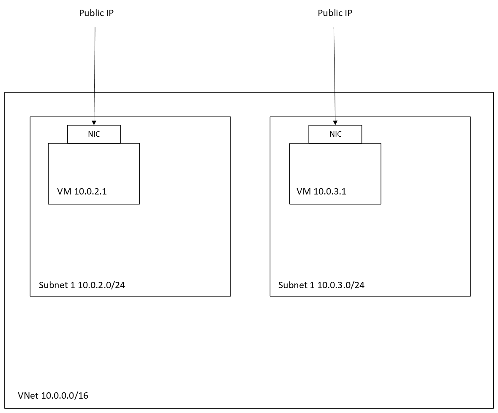

## Azure Fundamentals

- One of the 3 major cloud providers, alongside AWS and GCP.
- Cloud computing is a way of accessing computing resources over the internet, usually.
- The services provided can vary from Compute, Storage and Database, Analytics and AI/ML, IoT, Networking etc.

### How do we know if something is in the Cloud?

- If the data, applications or services are accessible from an internet-enabled device without being tied to specific hardware, likely they are in the cloud.

### Difference between on-prem and the cloud?

| Feature                 | On-Premises                  | Cloud                              |
|-------------------------|------------------------------|------------------------------------|
| **Infrastructure**      | Local data centres and servers. | Hosted in remote data centres.    |
| **Cost**                | High upfront hardware costs (CapEx). | Pay-as-you-go (OpEx).             |
| **Maintenance**         | Managed in-house.            | Managed by the cloud provider.    |
| **Scalability**         | Limited by physical hardware. | Near-infinite scalability.        |
| **Access**              | Local access within organisation. | Accessible from anywhere online.  |

### Cloud Deployment Models

- Private Cloud:
  - Definition: Cloud infrastructure is dedicated to a single organisation.
  - Use Case: Industries with strict security and compliance (e.g., finance, healthcare).
  - Advantages: High control, customisation, and security.
  - Disadvantages: High costs and limited scalability compared to public cloud.

- Public Cloud:
  - Definition: Cloud resources are shared among multiple users/organisations.
  - Use Case: Startups, SMEs, or anyone looking for cost-effective solutions.
  - Advantages: Low cost, easy to scale, minimal maintenance.
  - Disadvantages: Lower control and potential security concerns.

- Hybrid Cloud:
  - Definition: Combines private and public clouds, allowing data and applications to move between them.
  - Use Case: Organisations needing to balance security (private) with scalability (public).
  - Advantages: Flexibility and optimised costs.
  - Disadvantages: Complexity in integration and management.

- Multi-Cloud:
  - Definition: Using multiple cloud providers to optimise performance and avoid vendor lock-in.
  - Use Case: Large enterprises or organisations with diverse requirements.
  - Advantages: Resilience, vendor flexibility.
  - Disadvantages: Increased complexity and potential cost inefficiencies.

The **shared responsibility model** for the cloud means that depending on the cloud service model (IAAS, PAAS, SAAS), the responsibility the cloud provider has vs the client varies.

- **IAAS** - Infrastructure as a Service e.g. VMs.
- **PAAS** - Platform as a Service e.g. Azure App Service.
- **SAAS** - Software as a Service e.g. Office 365.

### Best practises

#### Naming conventions

- Include resource type at the end of the name e.g. end with "vnet".
- For vnets, good to include number of subnets in that vnet e.g. "2-subnet-vnet".

#### Tags

- Added key: value owner: Sameem as tags to serve as identifiers for my resources.

### Architecture

- As an exercise, will create a VNet, 2 subnets and an Ubuntu VM that we will access via SSH.
- See below for the architecture:

### Creating a VNet

- Azure Virtual Network (VNet) is the foundation of our infrastructure.
- Allows other services, like VMs, to connect to each other.
- If we configure public IPs for the resource, we can reach it from our local machine.
- By default, VNets have a CIDR address space of 10.0.0.0/16.
- name: "tech501-sameem-2-subnet-vnet"

### Creating Subnets

- Division of a VNet.
- I have defined two /24 subnets, under "public subnet" and "private subnet".

### Creating the VM

- Name: tech501-sameem-first-vm
- Region: UK South
- Security: standard
- Image: Ubuntu Pro 18.04 LTS Gen 2
- Size: Standard_B1s — 1 vcpu, 1 GiB
- Administrator account: adminuser
- Use existing key pair stored in Azure (use the one with sameem)
- Select inbound ports: allow HTTP and SSH traffic (currently open to access from the internet)
- Disks tab:
  - OS disk type: Standard SSD
Networking tab:
  - Virtual network: tech501-sameem-2-subnet-vnet
  - Subnet: public-subnet

### Connecting to the VM

- Use SSH key as its safer than password authentication.
- Generate SSH public-private keypair, using RSA algorithm.
- Ensure NSG allows ports for SSH (22) and HTTP (80).
- Connect to the VM using SSH, providing our private key.